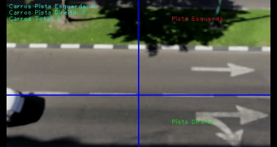

# Contagem de carros com OpenCV 4.1.1

 Nesse estudo vamos utilizar a biblioteca <b> OpenCV (versão 4.1.1) </b> 

 O objetivo deste projeto é realizar alguns estudos/testes na área de visão computacional, especialmente na contagem de carros que passaram por uma pista. 

 A análise que vamos realizar será a contagem de carros que passaram pela pista da esquerda (acima da faixa) e pela pista da direita (abaixo da faixa). 

 Os exemplos utilizados neste estudo foram baseados no site: 

https://opencv-python-tutroals.readthedocs.io/en/latest/py_tutorials/py_tutorials.html

 O video utilizado foi retirado do site: 

https://pixabay.com/pt/videos/carros-estrada-tr%C3%A1fego-condu%C3%A7%C3%A3o-133/

## Informação sobre os arquivos:

 <b>detecta_veiculos.py </b> - Esse é o programa principal que realiza a contagem de carros no vídeo. 

##### Resultado da contagem:

